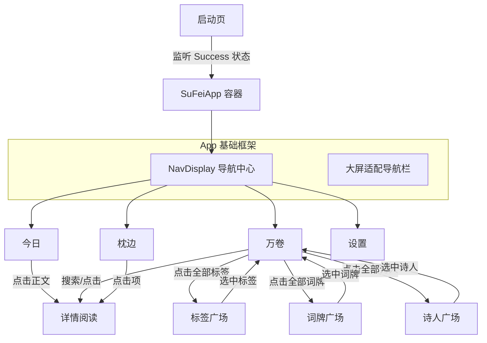

# 素扉 (SuFei) App 详细设计规范

## 1. 项目愿景 (Vision)
“素扉”是一款专注于中国传统诗词沉浸式阅读的应用。
- **素**：简约、留白、纯粹。
- **扉**：开启文化之门。
旨在打造一个无广告、无干扰，且符合 Android 最新 Material 3 设计规范 of the “数字诗集”。

---

## 2. 页面架构与布局 (Page Architecture)

### 2.1 启动与数据初始化 (Splash / Initialization)
- **定位**：处理海量诗词数据的首次导入，建立 App 艺术基调。
- **布局**：
  - **核心 Logo**：屏幕中心展示衬线体“素扉”二字，极轻字重，字间距 `8.sp`，传达疏朗感。
  - **初始化进度**：底部显示极简线型进度条（LinearProgressIndicator）。
  - **文学化提示**：进度条下方显示流动的文学提示语（如：“正在为您裁切宣纸...”，“墨香已至...”）。
- **交互**：初始化完成后，自动销毁启动容器并挂载 `SuFeiApp` 主屏。

### 2.2 底部导航主站 (Main Tabs)
采用 Material 3 响应式导航组件，支持大屏适配。

#### A. 今日 (Home / Daily)
- **定位**：每日情感共鸣点，提供“大字报”式的极简阅读。
- **布局**：
  - **两端分布 (SpaceBetween)**：页面采用左右对冲布局. 标题区域稳居左侧，核心名句稳居右侧，中间保持大面积留白（横向 Padding 56.dp）。
  - **多列竖排标题**：标题支持多列竖排（Column Chunking），单列上限为 8 字，超过时自动向左分列，确保长标题不截断且具备古籍感。
  - **核心名句（竖排）**：屏幕右侧展示。诗词内容采用**从右往左**的竖排布局。使用 `headlineMedium` 衬线体，字间距 `2.sp`，列间距 `40.sp`。标点符号（，。等）采用右上偏移处理。
  - **作者印章**：位于标题下方。采用“妃红色” (#E09E87) 细边框包裹，宽度随字数自动适配（Intrinsic Size），模拟朱印艺术效果。
  - **快捷操作**：底部提供“分享”与“收藏”功能，图标采用低饱和度处理以减少视觉干扰。
- **交互**：点击中心区域，平滑跳转至该诗词的“阅读详情页”。

#### B. 万卷 (Explore / Library)
- **定位**：结构化检索与发现中心。
- **布局**：
  - **顶部**：嵌入式 SearchBar。
  - **中部**：**三级极简过滤体系**。
    - **朝代行**：展示“唐代、宋代...”等热门朝代。
    - **词牌行**：展示常用词牌名。末尾提供“全部词牌”入口。
    - **标签行**：展示常用题材标签。末尾提供“全部标签”入口。
  - **下部**：**分区预览区域**。
    - 采用交错瀑布流（Staggered Grid）。
    - 结果按类别严格分区：先展示 **“诗人”** 小标题及匹配的诗人卡片，随后展示 **“诗词”** 小标题及匹配的诗词作品。
- **交互**：
  - **动态标题栏**：支持 **Hide-on-Scroll**。向下滚动列表时，自动隐藏顶部的搜索与过滤区域，以释放屏幕空间给内容；向上滚动时自动恢复显示。
  - 点击卡片跳转详情。

#### C. 枕边 (Collection / Bedside)
- **定位**：个人私藏的文学库。
- **布局**：
  - 采用优雅的列表视图，按收藏时间倒序排列。
  - 弱化边框，增强列表的整体流动感。
- **交互**：左滑快速取消收藏，点击进入阅读。

#### D. 设置 (Settings)
- **定位**：个性化与数据管理。
- **功能**：
  - **阅读设置**：调节全局字体、行间距、字号。
  - **主题**：Material You 动态色彩开关。

### 2.3 阅读中心 (Reader / Detail)
- **定位**：极致的沉浸式深度阅读体验。
- **布局**：
  - **主内容区 (PoemReader)**：
    - **标题**：采用 `headlineMedium` 衬线加粗，居中展示。
    - **作者与朝代**：紧随标题下方，格式为“朝代 · 作者”，色调淡雅。
    - **标签组 (TagCloud)**：位于作者下方。以极简的文本 Chip 形式展示诗词分类标签。
    - **正文**：页面核心展示区，采用 `displaySmall` 衬线体，大行间距（1.8em - 2.2em）。
  - **解读区 (InterpretationSection)**：位于正文下方。
- **交互**：沉浸式阅读，取消点击/双击交互。

### 2.4 广场系列 (The Squares)
*包含：标签广场、词牌广场、诗人广场*
- **统一模板逻辑**：所有广场页共用 `SquareViewModel` 与 `SquareScreen`。
- **布局规范 (Square Template)**：
  - **极简流式布局**：使用 `FlowRow` 自动换行。
  - **纯名展示**：仅以 `SuggestionChip` 形式平铺展示所有项（标签名/词牌名/诗人名），不含冗余信息。
- **交互逻辑**：
  - **标签/词牌广场**：点击名称返回“万卷”页并自动应用该项过滤。
  - **诗人广场**：点击名称直接跳转至对应 **诗人详情 (Poet Detail)**。

### 2.5 诗人详情 (Poet Detail)
- **定位**：文人墨客的艺术档案。
- **布局**：
  - **头部**：诗人姓名、朝代、头像（占位或真实资源）、一句话生平。
  - **内容区**：滚动展示 `descriptions` 集合（生平、成就、轶事等），每项采用“标题+段落”结构。
  - **作品区**：展示该诗人在馆内的所有诗词作品。

---

## 3. 页面跳转逻辑 (Navigation Flow)

---

## 4. 关键交互规范 (Interaction Spec)
1. **层级分明**...
2. **触感反馈**...
3. **多维联动**：在“万卷”页面，用户可以同时勾选“宋代”+“苏轼”+“定风波”，实现极精准的定位。

---

## 5. 视觉规范 (Design Tokens)
...（保持原有规范）
