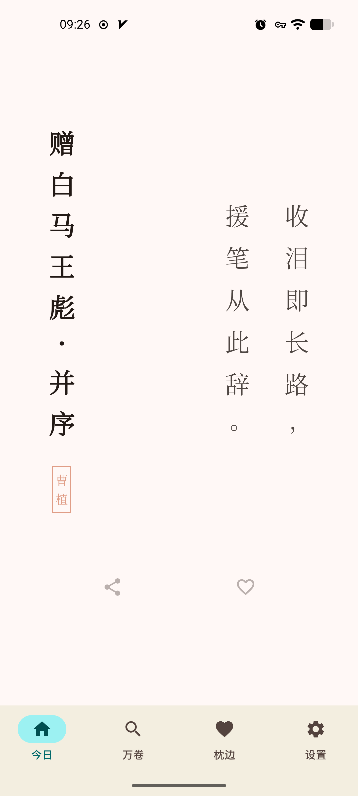
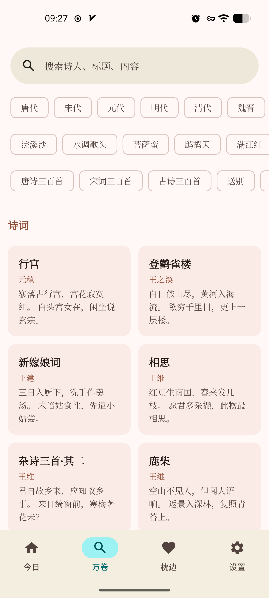
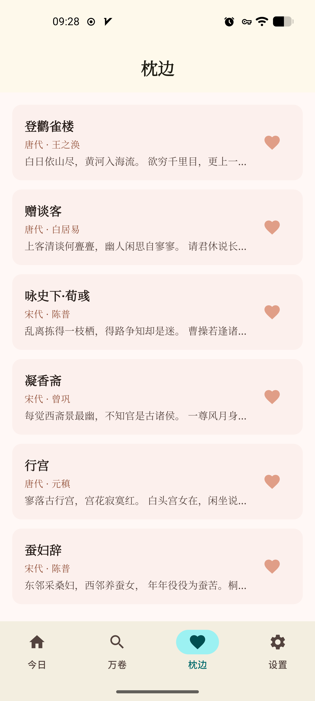
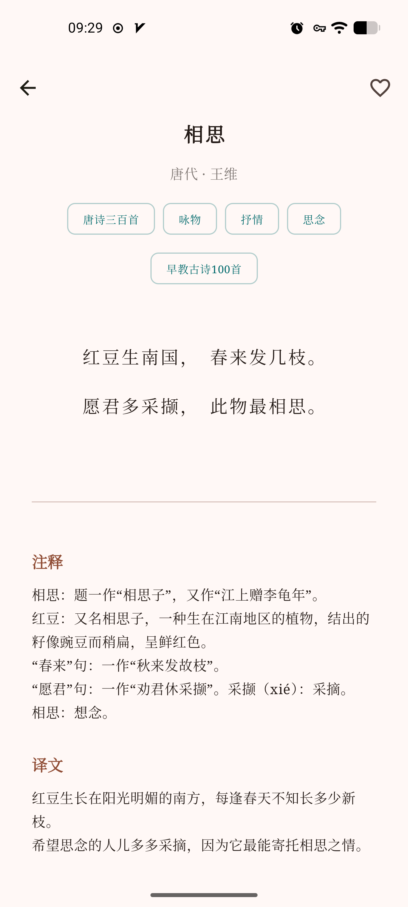
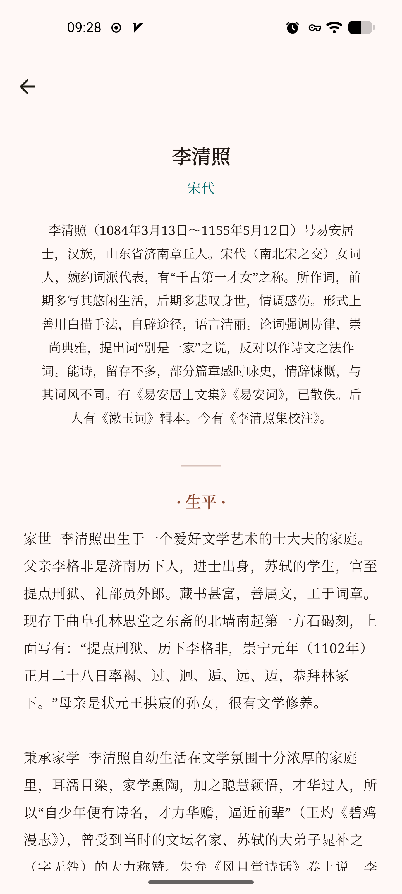
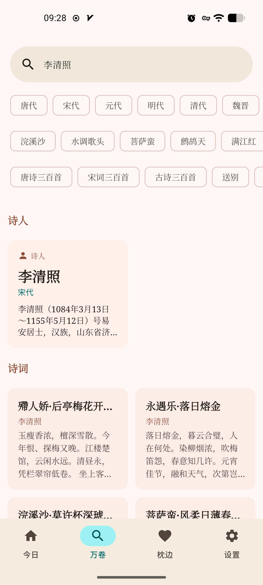
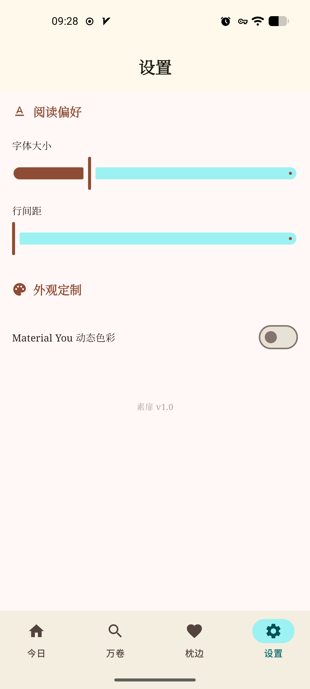

# 素扉 (SuFei) — 数字诗集

<p align="center">
  
  
  
  
</p>

**素扉**（SuFei）是一款基于 **Material 3** 设计规范的极简中国传统诗词应用。它不只是一个工具，更是一个宁静的数字阅读空间。我们摒弃了繁琐的社交功能与广告，只为还原最纯粹的诗词意境。

---

## 📸 视觉预览 (Screenshots)

### 核心页面
<p align="center">
  
  
  
</p>

### 详情与功能
<p align="center">
  
  
  
  
</p>

> [!TIP]
> **设计特色**：首页采用传统**竖排布局**，配合衬线字体与妃红印章，还原古籍美学。全站支持 **Material You** 动态色彩。

---

## ✨ 核心特性

- 🏛️ **现代架构**：完全基于 **Now in Android** 的响应式编程模型，遵循 Clean Architecture。
- 📖 **沉浸式阅读**：模拟宣纸质感，支持衬线字体，针对长短句自动优化的排版算法。
- 📅 **每日偶遇**：智能提取算法，每 10 分钟自动在首页推荐一段意境完整的经典诗句。
- 🔍 **万卷搜寻**：三级极简过滤（朝代/词牌/标签），毫秒级全文检索。
- 🎭 **文体感知**：自动识别诗/词/曲，针对“词”自动提取精华结拍（末尾句）进行展示。
- 🎨 **优雅动效**：基于 Navigation 3 实现全局淡入淡出，原生支持 Android 13+ **预测性返回**手势。

---

## 🛠️ 技术栈 (Tech Stack)

| 维度 | 技术选型 |
| :--- | :--- |
| **UI** | Jetpack Compose (1.7+) |
| **Navigation** | Navigation 3 (Experimental Compose API) |
| **DI** | Hilt |
| **Database** | Room |
| **Storage** | Proto DataStore |
| **Concurrency** | Kotlin Coroutines & Flow |

---

## 📂 项目结构

```text
app/src/main/java/dev/wceng/sufei/
├── data/           # 数据层：Room 实体、DAO、DataStore、Repository 实现
├── di/             # 依赖注入：Hilt 模块
├── ui/             
│   ├── navigation/ # 路由定义与 Navigator 封装
│   ├── screens/    # 功能屏幕实现（Home, Explore, Detail, etc.）
│   └── theme/      # Material 3 主题配置
└── MainActivity.kt # 入口 Activity
```

---

## 🚀 快速开始

1. **环境**：确保你的 Android Studio 版本为 **Ladybug (2024.2.1)** 或更新。
2. **克隆**：`git clone https://github.com/wceng/SuFei.git`
3. **运行**：本项目使用 `libs.versions.toml` 管理依赖，直接 Sync Gradle 即可运行。

---

## 📄 开源协议

本项目基于 **MIT License** 开源。欢迎任何形式的 PR 和 Issue！

---

<p align="center"> 如果这个项目触动了你的文人情怀，请点一个 <b>Star</b> ⭐ 鼓励我们。 </p>
