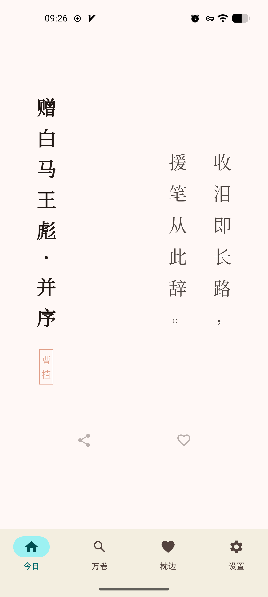
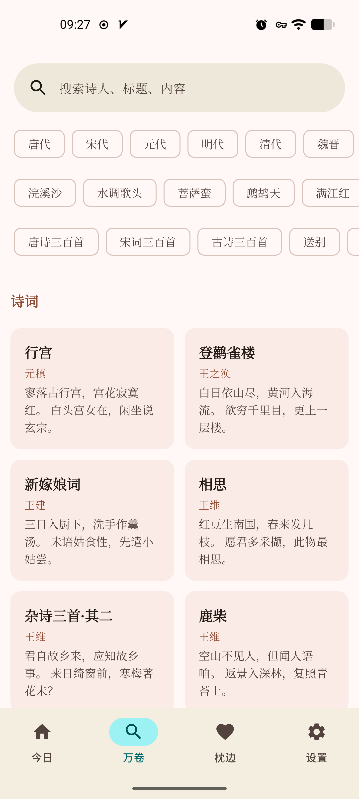
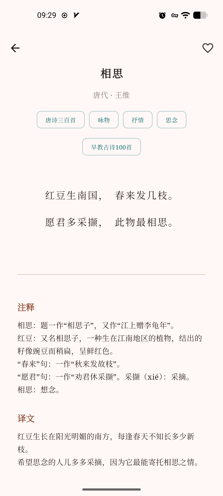
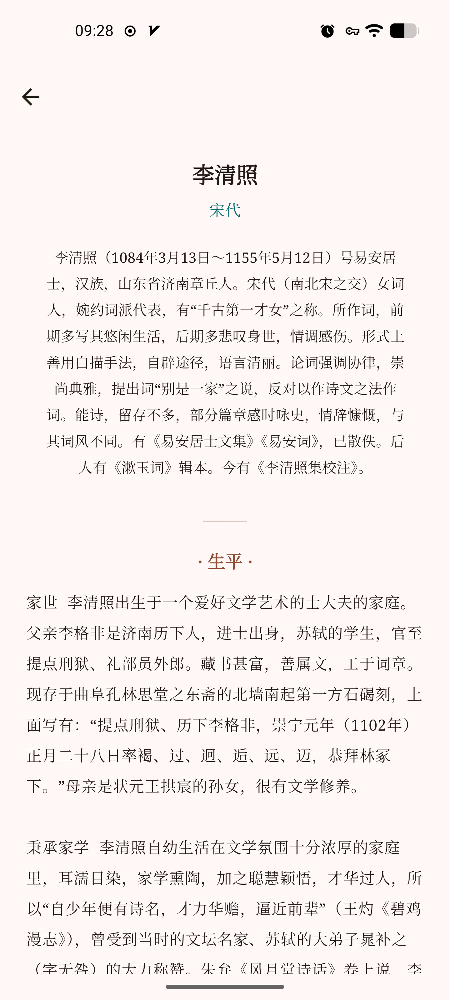
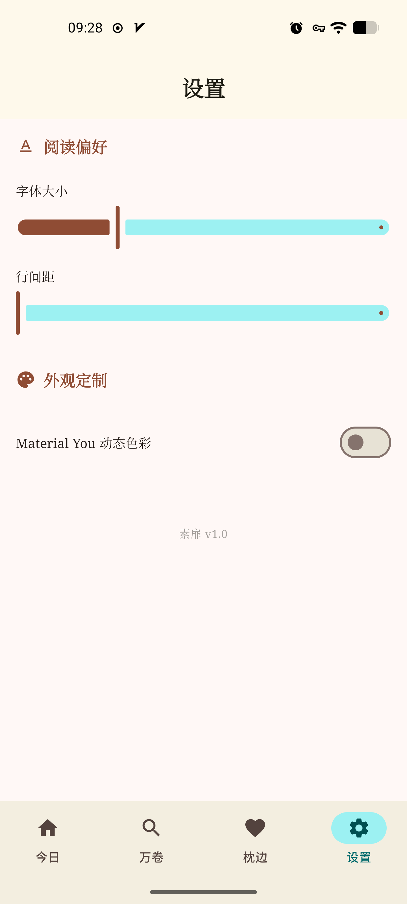
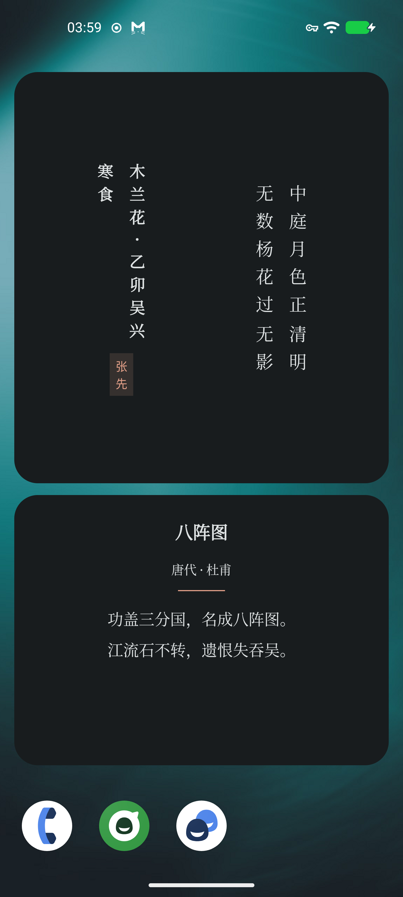

# 素扉 (SuFei) — 数字诗集

  
  
  
  
  

**素扉**（SuFei）是一款基于 **Material 3** 设计规范的极简中国传统诗词应用。它不只是一个工具，更是一个宁静的数字阅读空间。

---

## 📸 视觉预览 (Screenshots)

  
  
  
  

  
  
  
  

> [!TIP]
> **设计特色**：首页采用传统**竖排布局**，配合衬线字体与妃红印章，还原古籍美学。全站支持 **Material You** 动态色彩。

---

## ✨ 核心特性

- 🏛️ **现代架构**：遵循 Clean Architecture 规范，代码分层清晰，易于维护和扩展。
- 📖 **沉浸式阅读**：宣纸质感背景与衬线字体，排版随诗词长短句自动适配，自然舒适。
- 🎙️ **随心朗读**：接入系统 TTS 引擎，支持全文朗读与逐句高亮，感受诗词的韵律之美。
- 📅 **诗词偶遇**：首页采用灵动的无限卡片堆栈设计，每一次划动都是一场与高质量经典诗词的不期而遇。
- 🔍 **万卷搜寻**：通过朝代、词牌、标签三级过滤，快速定位心仪的诗词。
- 🎭 **文体感知**：自动识别诗、词、曲不同体裁，对词作优先展示其结尾精华句。
- 🎨 **优雅动效**：页面切换采用淡入淡出过渡，原生支持 Android 13+ 预测性返回手势。
- 🏠 **桌面小组件**：提供"每日一言"与"枕边诗"两种小组件，让诗词融入日常。

---

## 📚 数据集 (Dataset)

本应用内置了涵盖二十万余首作品的本地诗词库，支持离线查阅：

- 📜 **体裁丰富**：诗、词、曲、文言文等，一应俱全。
- 🏛️ **通览古今**：从先秦到近现代，跨越各朝各代。
- 👤 **万名诗人**：收录了 10,000 余位文学家的生平与代表作。
- 🏷️ **精细分类**：上千个意境标签与词牌分类，让你总能找到想要的。

> 数据来源：[Poetry_CN - OpenDataLab](https://opendatalab.org.cn/ABear/Poetry_CN)、[poems-db - GitHub](https://github.com/yxcs/poems-db)

---

## 🛠️ 技术栈 (Tech Stack)

| 维度 | 技术选型 |
| :--- | :--- |
| **UI** | Jetpack Compose (1.7+) |
| **Navigation** | Navigation 3  |
| **Splash** | Core SplashScreen API |
| **DI** | Hilt |
| **Database** | Room |
| **Storage** | Proto DataStore |
| **Concurrency** | Kotlin Coroutines & Flow |

---

## 📥 下载 (Download)

您可以从以下渠道获取最新版本：

- **GitHub Releases**: [点击前往](https://github.com/wceng/SuFei/releases)
- **F-Droid**: [在 F-Droid 上获取](https://f-droid.org/zh_Hans/packages/dev.wceng.sufei/)

---

## 🚀 快速开始

1. **环境**：Android Studio 版本为最新即可。
2. **克隆**：`git clone https://github.com/wceng/SuFei.git`
3. **运行**：本项目使用 `libs.versions.toml` 管理依赖，直接 Sync Gradle 即可运行。

---

## 📄 开源协议

本项目基于 **MIT License** 开源。欢迎任何形式的 PR 和 Issue！

---
